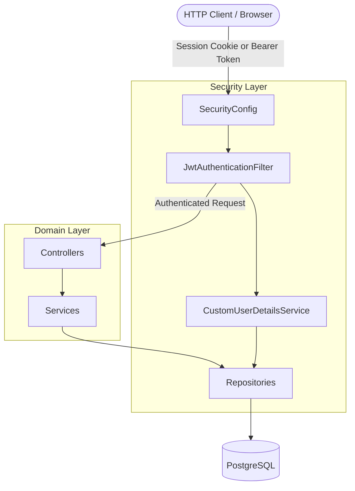
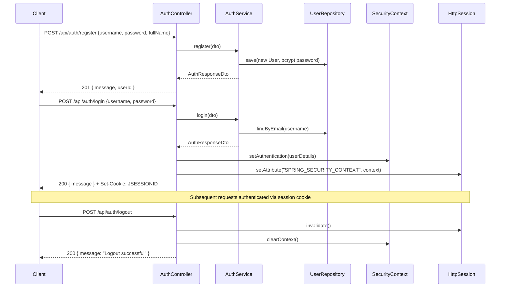
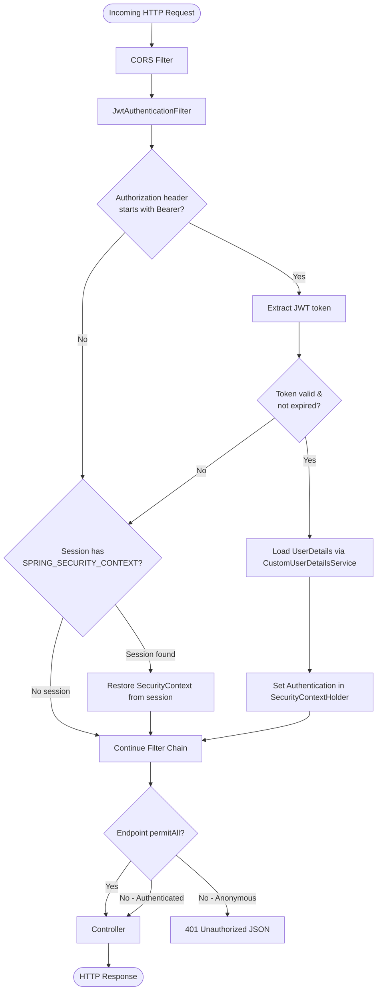
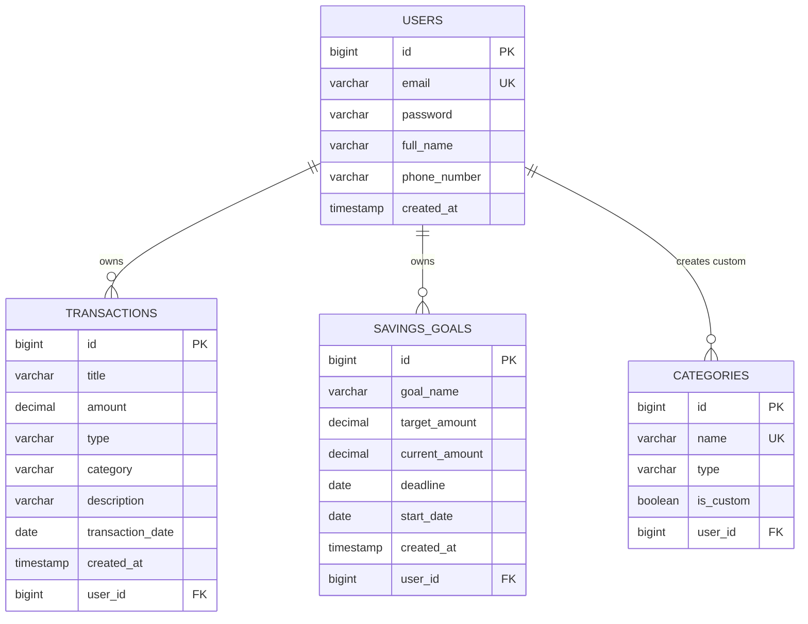

# PFTapi - Personal Finance Tracker API

A RESTful API built with Spring Boot 3 for managing personal financial transactions, categories, savings goals, and generating financial reports.

---

## Architecture

```
src/main/java/com/financeapp/
├── config/
│   ├── DatabaseSeeder.java       -- Seeds default categories on startup
│   └── SecurityConfig.java       -- Spring Security, CORS, session filter chain
├── controller/
│   ├── AuthController.java       -- POST /api/auth/register, /login, /logout, GET /me
│   ├── TransactionController.java-- CRUD for /api/transactions
│   ├── CategoryController.java   -- CRUD for /api/categories
│   ├── SavingsGoalController.java-- CRUD for /api/goals
│   └── ReportController.java     -- GET /api/reports/summary, /monthly, /yearly
├── dto/                          -- Request and response transfer objects
├── entity/                       -- JPA entities (User, Transaction, Category, SavingsGoal)
├── enums/                        -- TransactionType (INCOME, EXPENSE)
├── exception/                    -- GlobalExceptionHandler, custom exceptions
├── mapper/                       -- Entity to DTO mappers
├── repository/                   -- Spring Data JPA repositories
├── security/                     -- JwtAuthenticationFilter, CustomUserDetailsService
├── service/                      -- Business logic interfaces and implementations
└── util/                         -- JwtUtils (HMAC-SHA256 token generation/validation)
```

---

## System Design

### 1. Overall System Architecture



---

### 2. Authentication & Session Flow



---

### 3. Request Lifecycle & Filter Chain



---

### 4. Domain Entity Relationship



---

## Technology Stack

| Component         | Technology                                          |
|-------------------|-----------------------------------------------------|
| Language          | Java 17                                             |
| Framework         | Spring Boot 3.4.0                                   |
| Security          | Spring Security + Session (IF_REQUIRED) + JWT filter |
| Database          | PostgreSQL 15 (Docker)                              |
| ORM               | Spring Data JPA / Hibernate 6                       |
| Build Tool        | Maven                                               |
| API Documentation | springdoc-openapi / Swagger UI                      |
| Testing           | JUnit 5, Mockito, MockMvc                           |
| Containerisation  | Docker, Docker Compose                              |

---

## Setup and Running

### Prerequisites

- Java 17+
- Maven 3.8+
- Docker Desktop

### Environment Variables

Create a `.env` file in the project root directory:

```ini
DB_HOST=localhost
DB_PORT=5432
DB_NAME=personal_finance
DB_USER=postgres
DB_PASSWORD=password
JWT_SECRET=xxxxxxxxx
JWT_EXPIRATION_MS=86400000
```

### Option 1: Docker Compose

```bash
docker-compose up --build
```

Backend API will be available at `http://localhost:8080`.  
Swagger UI will be available at `http://localhost:8080/swagger-ui.html`.

### Option 2: Local Run

1. Start a PostgreSQL instance with the credentials from your `.env` file.
2. Run the application:

```bash
mvn clean spring-boot:run
```

### Run Tests

```bash
mvn clean test
```

---

## API Reference

### Authentication

All endpoints except `/api/auth/register` and `/api/auth/login` require a valid session cookie (`JSESSIONID`) or `Authorization: Bearer <token>` header.

#### Register

```
POST /api/auth/register
```

Request:
```json
{ "username": "user@example.com", "password": "password123", "fullName": "John Doe", "phoneNumber": "+1234567890" }
```

Response (201):
```json
{ "message": "User registered successfully", "userId": 1 }
```

#### Login

```
POST /api/auth/login
```

Request:
```json
{ "username": "user@example.com", "password": "password123" }
```

Response (200):
```json
{ "message": "Login successful" }
```

Sets a session cookie (`JSESSIONID`) for subsequent authenticated requests.

#### Logout

```
POST /api/auth/logout
```

Response (200):
```json
{ "message": "Logout successful" }
```

---

### Transactions

#### Create Transaction

```
POST /api/transactions
```

Request:
```json
{ "amount": 50000.00, "date": "2024-01-15", "category": "Salary", "description": "January Salary" }
```

Response (201):
```json
{ "id": 1, "amount": 50000.00, "date": "2024-01-15", "category": "Salary", "description": "January Salary", "type": "INCOME" }
```

#### Get Transactions

```
GET /api/transactions?startDate=2024-01-01&endDate=2024-01-31&category=Salary&type=INCOME&page=0&size=10&sortBy=date&sortDir=desc
```

Response (200):
```json
{ "transactions": [...], "totalElements": 10, "totalPages": 1 }
```

#### Update Transaction

```
PUT /api/transactions/{id}
```

Request:
```json
{ "amount": 60000.00, "description": "Updated salary" }
```

#### Delete Transaction

```
DELETE /api/transactions/{id}
```

Response (200):
```json
{ "message": "Transaction deleted successfully" }
```

---

### Categories

#### Get All Categories

```
GET /api/categories
```

Response (200):
```json
{ "categories": [ { "name": "Salary", "type": "INCOME", "isCustom": false } ] }
```

#### Create Custom Category

```
POST /api/categories
```

Request:
```json
{ "name": "SideBusinessIncome", "type": "INCOME" }
```

Response (201):
```json
{ "name": "SideBusinessIncome", "type": "INCOME", "isCustom": true }
```

#### Delete Custom Category

```
DELETE /api/categories/{name}
```

Response (200):
```json
{ "message": "Category deleted successfully" }
```

---

### Savings Goals

#### Create Goal

```
POST /api/goals
```

Request:
```json
{ "goalName": "Emergency Fund", "targetAmount": 5000.00, "targetDate": "2026-01-01", "startDate": "2025-01-01" }
```

Response (201):
```json
{ "id": 1, "goalName": "Emergency Fund", "targetAmount": 5000.00, "targetDate": "2026-01-01", "startDate": "2025-01-01", "currentProgress": 1000.00, "progressPercentage": 20.00, "remainingAmount": 4000.00 }
```

#### Get All Goals

```
GET /api/goals
```

#### Get Goal by ID

```
GET /api/goals/{id}
```

#### Update Goal

```
PUT /api/goals/{id}
```

Request:
```json
{ "targetAmount": 6000.00, "targetDate": "2026-02-01" }
```

#### Delete Goal

```
DELETE /api/goals/{id}
```

Response (200):
```json
{ "message": "Goal deleted successfully" }
```

---

### Reports

#### Financial Summary

```
GET /api/reports/summary
```

Response (200):
```json
{ "totalIncome": 36000.00, "totalExpenses": 19200.00, "currentBalance": 16800.00, "monthlySpend": 1600.00, "categoryBreakdown": { "Food": 4800.00, "Rent": 14400.00 }, "goalsProgress": [...] }
```

#### Monthly Report

```
GET /api/reports/monthly/{year}/{month}
```

Response (200):
```json
{ "month": 1, "year": 2024, "totalIncome": { "Salary": 3000.00 }, "totalExpenses": { "Food": 400.00, "Rent": 1200.00 }, "netSavings": 1400.00 }
```

#### Yearly Report

```
GET /api/reports/yearly/{year}
```

Response (200):
```json
{ "year": 2024, "totalIncome": { "Salary": 36000.00 }, "totalExpenses": { "Food": 4800.00, "Rent": 14400.00 }, "netSavings": 16800.00 }
```

---

## Error Handling

| Status Code | Scenario                                                   |
|-------------|------------------------------------------------------------|
| 400         | Validation errors, malformed input                         |
| 401         | Invalid credentials, missing authentication                |
| 403         | Accessing another user's resource                          |
| 404         | Requested resource not found                               |
| 409         | Duplicate email on registration, duplicate category name   |

All error responses follow this structure:

```json
{ "timestamp": "2024-01-15T10:00:00", "status": 400, "error": "Bad Request", "message": "Amount must be a positive number", "path": "/api/transactions" }
```

---

## Design Decisions

### Layered Architecture

The application follows a strict Controller -> Service -> Repository layered pattern. Controllers handle HTTP serialization only. All business rules and validations live in the service layer. Repositories handle only data access queries.

### Session-Based Authentication with JWT Fallback

The server uses `SessionCreationPolicy.IF_REQUIRED`. On login, the controller manually registers the authentication in the `SecurityContext` and persists it into the `HttpSession`. The `JwtAuthenticationFilter` runs first on every request — if a valid `Bearer` token is present it authenticates via that token; otherwise Spring restores the session context from the `JSESSIONID` cookie automatically.

### Category Isolation

System-wide default categories have a null user_id, making them visible to all users. Custom categories are linked to the creating user's account. A single JPA query handles both cases: `SELECT c FROM Category c WHERE c.user IS NULL OR c.user = :user`.

### Transaction Type Derivation

The transaction type (INCOME or EXPENSE) is automatically derived from the referenced category entity on the backend. This prevents inconsistent states where a transaction could claim a type that conflicts with its category.

### Progress Calculation for Savings Goals

Progress is calculated dynamically as the sum of (Total Income - Total Expenses) since the goal's start date. This is a live calculation against the transactions table, ensuring deleted transactions are automatically excluded from the progress figure.

### Idempotent Database Seeding

The `DatabaseSeeder` checks for the existence of each default category by name before inserting. This makes startup seeding safe across container restarts without requiring a clean database.
